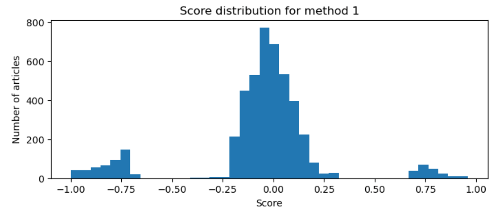
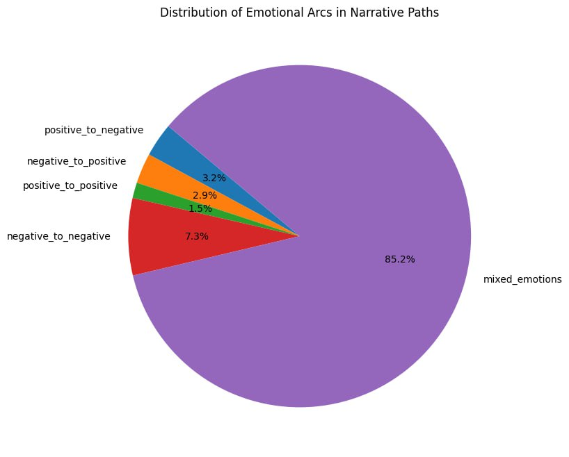
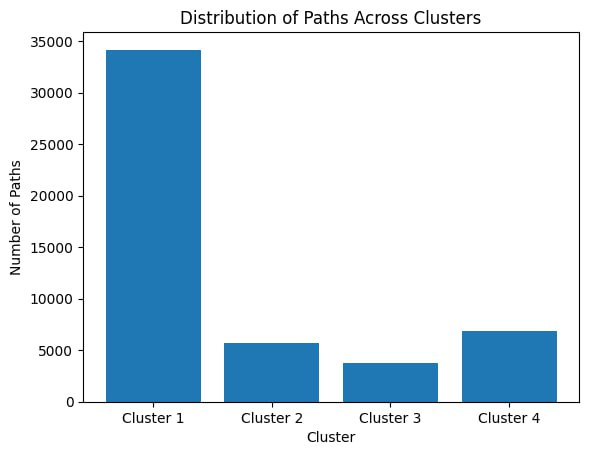
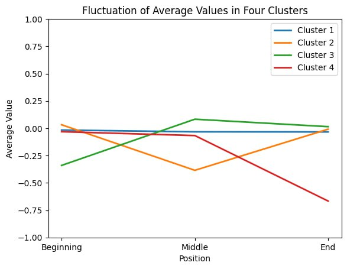
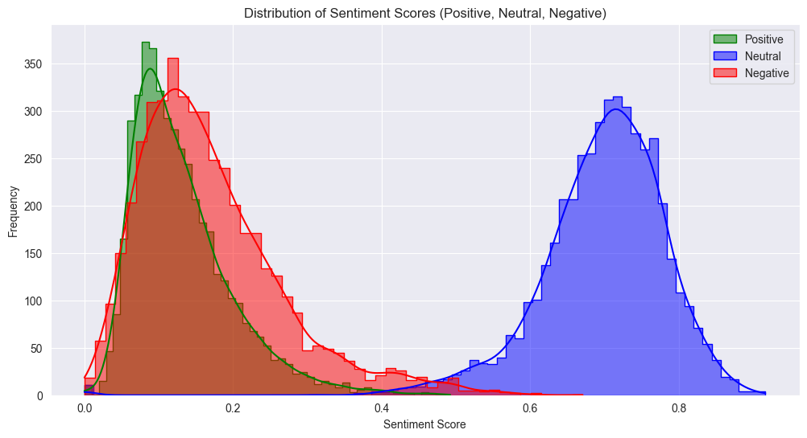
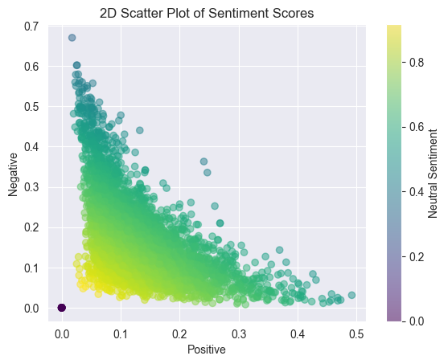
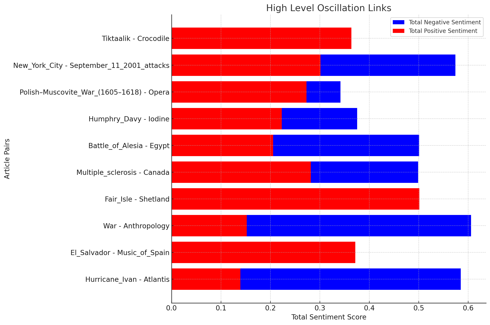
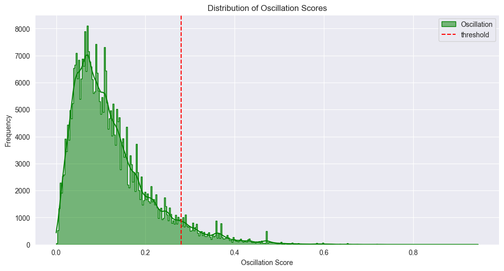

In today's world, where we're constantly bombarded with information from all sides, it's interesting to think about what drives our choices as we navigate through this vast digital space. Consider Wikispeedia, a game that's similar to moving through Wikipedia, where each click opens up new information. What really influences these choices we make? Is it just a search for information, or are our emotions playing a role too?

This is the focus of our project, "Objectivity through the emotional lens: How does the sentiment of Wikispeedia articles affect player game paths?" We're looking into whether the emotional tone of an article - whether it's positive, negative, or neutral - has an effect on where players go next in the game. Our goal is to find out how the emotions conveyed in text can affect the way we interact with digital content.

Our analysis is based on the Wikispeedia navigation paths dataset, a dataset that collected information from more than 70'000 games from players of all ages and nationalities. However, no information on the emotional side was provided (imagine if the dlab could read our brains). Therefore, we had to find a way to add this dimension to the data in order to carry out our analysis. We did it in the easiest and most comprehensive way possible: each article was assigned an emotional score between -1 and 1. The more negative the score is, the more negatively connotated the article is. The more positive the score is, (surprise!) the more positively connotated the article is.

For this purpose, we decided to try out different methods, and compare the results to a validation set of articles that were labelled manually. The method that performed the best was the RoBERTa model (Liu et al., 2019). The model was run on all the wikipedia articles' plaintext content to extract three different scores (positive, neutral and negative) that were finally converted into a sole emotional score between -1 and 1. By doing this, we assume that the wikipedia articles are representative of the impression that we get from a word. This is actually not that big of an assumption, as the final scores were compared to manually labelled scores, and they matched most of the time!

So how much positiveness lies in wikipedia pages in general? Well not much: it's a pretty sad world. As we can see from the score distribution, a vast majority of the scores are neutral (86 %), a few are negative (10%), and even less are positive (4%). Does it means people are pessimistic and the word is doomed? It depends, as many words describe objects of human or natural occurence with no emotional connotations. As far as we know, "tables" are not sad nor does one associate them with an emotional response (but who knows?).

## Emotional Arc Analysis in Narrative Paths

In our study, we then delved into understanding the evolution of emotions in the users' narrative paths. By analyzing emotional arcs within a dataset of paths, each consisting of sentiment scores indicative of changing emotional states, we aimed to uncover the underlying patterns in these narratives. We categorized the paths into five emotional transitions: positive to negative, negative to positive, positive to positive, negative to negative, and mixed emotions. Our methodology centered on analyzing these paths to reveal prevalent emotional trends. We employed a function named 'analyze_emotional_arcs' to classify each path based on its sentiment trajectory. Our analysis unearthed insightful patterns, showing a predominance of mixed emotional arcs over others. 

To further enhance our understanding, we employed clustering techniques on the paths. This approach grouped similar emotional journeys together, uncovering prevalent patterns and themes.
Our analysis yielded insightful clusters, each representing distinct emotional trajectories. Notably, we found that the most common narrative path maintained a consistent neutral sentiment throughout, as we expected. For paths diverging from this trend, the predominant trajectories included either a negative emotional dip in the middle or a negative sentiment towards the end. Interestingly, the latter showed on average a much lower sentiment result. This is most likely due to users strategically navigating towards related negative subjects when the end target is a negatively perceived article, as it was for more than 80% of the articles in this cluster.

  
  

## Are there noticeable patterns of sentiment oscillation in the paths chosen by players?
we're exploring whether there's a pattern in how players choose their paths in Wikispeedia based on sentiment oscillation. Specifically, we're curious to see if players are drawn to paths with dramatic sentiment shifts, like going from an article with a positive tone to one that's decidedly negative. Our approach includes analyzing the overall distribution of sentiment oscillations in player choices and determining if players generally opt for paths with greater or lesser sentiment variance than the average level in the game. We're also looking into what factors might influence these choices, providing insight into how sentiment affects the journey through Wikispeedia.

### Does user tend to choose links with high/ low osscilation.
Most people believe that Wikipedia articles are predominantly neutral, as Wikipedia editors are rigorously screened and strive to avoid expressing personal emotions in their descriptions. As evident from the following score distributions, the majority of articles have significantly higher neutral scores compared to other scores, with neutral-themed articles constituting 88% of the total. From a correlation perspective, positive/negative scores vary inversely, as expected.

  
  

For each link chosen by users, we consider the difference in sentiment endpoints as a criterion for measuring oscillation. The threshold for interpolation is 0.28, meaning we consider a link to be oscillating if the difference in sentiment scores between two articles exceeds 0.28. This threshold was selected based on continuous trials of a specific quantile, followed by random sampling of ten links from the oscillating/non-oscillating groups and subsequent human validation. Several high oscillation links, as defined by this criterion, are illustrated below.

Next, we analyzed every link clicked by users and compared it to the oscillation values, resulting in the distribution shown below. It appears that users generally prefer links with low oscillation frequency, accounting for 6%. However, is this preference due to the predominant neutrality of Wikipedia articles? We conducted a significance test comparing the links chosen by users with the existing links on the network and found no significant difference in oscillation levels.

**In other words, the links chosen by users are not selected for their low oscillation levels but rather because Wikipedia articles are inherently neutral.**

### What influences oscillation of the path
We used the standard deviation of the sentiment value change on each path to represent the oscillation level of that path. The distribution of the results is as follows. Most of the paths chosen by users are non-oscillatory, which aligns with our previous analysis.

A natural assumption is that the oscillation strength of the paths chosen by users is related to the sentiment values of the start and end points. As illustrated in the following figure, we can see that the points at the edges (that have extreme values for source and destination) indeed tend to have a higher degree of oscillation.

To validate this, we conducted regression analysis on the path's oscillation using various parameters. We utilized four different models, their fitting outcomes and the parameters used, are summarized in the table below. 'Diff' represents the difference in sentiment values between the start and end points of the path.

| Model | R²    | src | dst | 25% quantile | 50% quantile | 75% quantile | Length | Mean | Diff |
|-------|-------|-----|-----|--------------|--------------|--------------|--------|------|------|
| 1     | 0.022 | X   | X   |              |              |              |        |      |      |
| 2     | 0.355 | X   | X   | X            | X            | X            |        |      |      |
| 3     | 0.439 | X   | X   | X            | X            | X            | X      | X    |      |
| 4     | 0.1   |     |     |              |              |              |        |      | X    |

Model 1 suggests that the impact of the start and end points on the path's oscillation is negligible. As we added more parameters from Model 1 to Model 3, there was no significant improvement in the fit. Notably, while these parameters are all significant, their influence on oscillation seems minimal. The oscillation appears to be related more to the path itself, rather than to any particularly strong influencing factors.

In Model 4, we considered the impact of the difference in emotional values between the start and end points of the path on its oscillation. This parameter, while not significantly influential, showed a moderate correlation (R=0.32) through correlation testing.