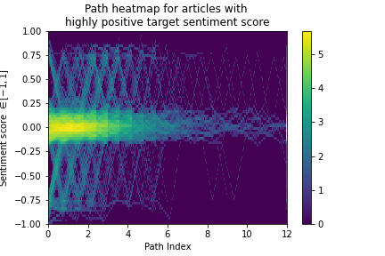

In today's world, where we're constantly bombarded with information from all sides, it's interesting to think about what drives our choices as we navigate through this vast digital space. Consider Wikispeedia, a game that's similar to moving through Wikipedia, where each click opens up new information. What really influences these choices we make? Is it just a search for information, or are our emotions playing a role too?

This is the focus of our project, "Objectivity through the emotional lens: How does the sentiment of Wikispeedia articles affect player game paths?" We're looking into whether the emotional tone of an article - whether it's positive, negative, or neutral - has an effect on where players go next in the game. Our goal is to find out how the emotions conveyed in text can affect the way we interact with digital content.

Here's an awesome image depicting a Wikispeedia game (generated by DALL·E). We will add colours to these little islands to uncover their connotated sentiments!

Our analysis is based on the Wikispeedia navigation paths dataset, a dataset that collected information from more than 70'000 games from players of all ages and nationalities. However, no information on the emotional side was provided. Therefore, we had to find a way to add this dimension to the data in order to carry out our analysis. We did it in the easiest and most comprehensive way possible: each article was assigned an emotional score between -1 and 1. The more negative the score is, the more negatively connotated the article is. The more positive the score is, (surprise!) the more positively connotated the article is.

For this purpose, we decided to try out different methods, and compare the results to a validation set of articles that were labelled manually. The method that performed the best was the RoBERTa model (Liu et al., 2019). The model was ran on all the wikipedia articles' plaintext content to extract three different scores (positive, neutral and negative) that were finally converted into a sole emotional score between -1 and 1. By doing this, we assume that the wikipedia articles are representative of the impression that we get from a word. This is actually not that big of an assumption, as the final scores were compared to manually labelled scores, and they matched most of the time!

So how much positiveness lies in wikipedia pages in general? Well not much: it's a pretty sad world. As we can see from the score distribution, a vast majority of the scores are neutral (86 %), a few are negative (10%), and even less are positive (4%). Does it mean people are pessimistic and the word is doomed? It depends, as many words describe objects of human or natural occurrence with no emotional connotations. As far as we know, "tables" are not sad nor does one associate them with an emotional response (but who knows?).

As the articles are clearly separated into negative (<-0.5), positive (>0.5) or neutral, the rounded scores (-1, 0 or 1, respectively negative, neutral and positive) are used in some of the analysis.

### Is the sentiment prevalent in any topic?
A first way to look at the data and see if we find something is to look at the wikipedia categories.
It is known that Wikipedia articles cover a wide range of topics, and sentiment within these articles of the same topic can be consistent with the subject matter. To investigate how sentiment is prominent within a topic, we utilised the topic data from categories.tsv dataset and studied the sentiment score of these extracted topics at different level of generality.

Please visit [this link](https://yrymax.github.io/ada-project-statsquad3/visual/) for an interactive story telling.

  

We can see that most of the topics had quite neutral sentiment, while topics about World War or Natural Disaster appear to be highly negative.

## Influence of the source and target articles

The starting article is the first thing the player is exposed to when the game begins. It makes sense to ask ourselves if the player is influenced by this article during the game. Indeed, if the starting article is positive, we could maybe expect the player to get cheerful and unconsciously head towards positive articles.
The variable which depicts this the most is the percentage of positive articles in the path excluding the first article (we don’t take the first article into account because we look at the probability of having positive articles knowing the starting article score).
This variable distribution is plotted for each starting article score below.

As we can see, the distributions look very similar. To check this, a Man-Whitney U statistical test is performed on the distributions and... as expected, the test confirms that they are indeed not different.
This tells us that the starting article score does not influence the positivity of the path, but what about its negativity ?

We perform the same analysis and get the the following graphs:

Same as before, the distributions look suspiciously similar. And same as before, the Man-Whithney test tells us that… they are indeed not different!

What can we learn from this ? Well, people are not influenced by the starting article when playing the game. Maybe this is just because they want to play really badly, and leave the starting article really quickly without caring much about it. However, they need to keep in mind the target article during the whole game, so maybe this one will have an influence? Let's see.

Since the beginning of this ada-venture, we spoke of these paths without really seeing why they are paths. Let's take a closer look:

  

Notice that most paths are concentrated around the neutral articles. This is normal! Remember the distribution of our sentiment scores above? Indeed, most articles are classified as neutral.

Note: if you're wondering why there are objects in between game steps, it's because we interpolated the path scores for a much easier visualisation (and much cooler let's be honest this graph is great).

Let's visualise this heatmap for games where the target article is positively or negatively connotated.

  

Games where the target article is positive are kind of balanced. But notice how, at the start of games, there seems to be more negativity, while at the end there seems to be more positivity? Note that in these plots we removed the target article, so this really means that positive targets mean positive games! Same goes for negative...

  

But... something's clear here: it's much more imbalanced than for games with positive targets! It's pretty clear now that the target article's sentiment influences the path structure, stretching it towards the sentiment direction at the end, and perhaps for the whole game in the case of negative targets. These plots however don't say much about the influence on the game score, in other words, the path length.

How do we win at this games without falling for the sentimentality of the graph? ("<i>Man is a political animal</i>" - Aristotle) 

Descriptive visualisations are nice, but they can often hide information from us. We proceed by doing a regression analysis to determine the predictive power of the target sentiment to predict the path length. This will tell us if, when given a certain target, how hard we can expect the game to be. The best model is given by:

While at first glance this model seems innocent, it hides some hidden misinformation. At the 0.05 significance level, the coefficient for the articles with reached targets is not significant, while the coefficient for the articles with unreached targets is significant. We conclude that unreached targets lower the average game length... This conclusion is clearly trivial: when players give up, it shortens the path length.

It would have been interesting to observe that, for instance, negative targets are more likely to make the player give up than positive targets. However, it does not seem to be the case. What does that tell us about human psychology online? When exploring the web, have we become completely insensible machines, completely unmindful of the information that we are reading? In a competitive context where both time and strategy are competing inside one's thinking process, it seems that from our analyses we cannot reach a unified conclusion about the effect of the target article's sentiment.
Remember the previous cool graph showing the paths ? It didn’t show any special path arc, however there are indeed a lot of paths, so maybe they are just hidden under the mass of neutral paths. This is investigated further in the next point.

## Emotional Arc Analysis in Narrative Paths

In our study, we then delved into understanding the evolution of emotions in the users' narrative paths. By analyzing emotional arcs within a dataset of paths, each consisting of sentiment scores indicative of changing emotional states, we aimed to uncover the underlying patterns in these narratives. We categorized the paths into five emotional transitions: positive to negative, negative to positive, positive to positive, negative to negative, and mixed emotions. Our methodology centered on analyzing these paths to reveal prevalent emotional trends. We employed a function named 'analyze_emotional_arcs' to classify each path based on its sentiment trajectory. Our analysis unearthed insightful patterns, showing a predominance of mixed emotional arcs over others. 

To further enhance our understanding, we employed clustering techniques on the paths. This approach grouped similar emotional journeys together, uncovering prevalent patterns and themes.
Our analysis yielded insightful clusters, each representing distinct emotional trajectories. Notably, we found that the most common narrative path maintained a consistent neutral sentiment throughout, as we expected. For paths diverging from this trend, the predominant trajectories included either a negative emotional dip in the middle or a negative sentiment towards the end. Interestingly, the latter showed on average a much lower sentiment result. This is most likely due to users strategically navigating towards related negative subjects when the end target is a negatively perceived article, as it was for more than 80% of the articles in this cluster.

  
  

We saw that there are some characteristic path arcs. However, these were based on the paths divided in three parts. Maybe we can find something interesting if we look at one specific arc, but this time in detail (article per article)?

## Are there noticeable patterns of sentiment oscillation in the paths chosen by players?
we're exploring whether there's a pattern in how players choose their paths in Wikispeedia based on sentiment oscillation. Specifically, we're curious to see if players are drawn to paths with dramatic sentiment shifts, like going from an article with a positive tone to one that's decidedly negative. Our approach includes analyzing the overall distribution of sentiment oscillations in player choices and determining if players generally opt for paths with greater or lesser sentiment variance than the average level in the game. We're also looking into what factors might influence these choices, providing insight into how sentiment affects the journey through Wikispeedia.

### Does user tend to choose links with high/ low osscilation.
Most people believe that Wikipedia articles are predominantly neutral, as Wikipedia editors are rigorously screened and strive to avoid expressing personal emotions in their descriptions. As evident from the following score distributions, the majority of articles have significantly higher neutral scores compared to other scores, with neutral-themed articles constituting 88% of the total. From a correlation perspective, positive/negative scores vary inversely, as expected.

  
  

For each link chosen by users, we consider the difference in sentiment endpoints as a criterion for measuring oscillation. The threshold for interpolation is 0.28, meaning we consider a link to be oscillating if the difference in sentiment scores between two articles exceeds 0.28. This threshold was selected based on continuous trials of a specific quantile, followed by random sampling of ten links from the oscillating/non-oscillating groups and subsequent human validation. Several high oscillation links, as defined by this criterion, are illustrated below.

Next, we analyzed every link clicked by users and compared it to the oscillation values, resulting in the distribution shown below. It appears that users generally prefer links with low oscillation frequency, accounting for 6%. However, is this preference due to the predominant neutrality of Wikipedia articles? We conducted a significance test comparing the links chosen by users with the existing links on the network and found no significant difference in oscillation levels.

**In other words, the links chosen by users are not selected for their low oscillation levels but rather because Wikipedia articles are inherently neutral.**

### What influences oscillation of the path
We used the standard deviation of the sentiment value change on each path to represent the oscillation level of that path. The distribution of the results is as follows. Most of the paths chosen by users are non-oscillatory, which aligns with our previous analysis.

A natural assumption is that the oscillation strength of the paths chosen by users is related to the sentiment values of the start and end points. As illustrated in the following figure, we can see that the points at the edges (that have extreme values for source and destination) indeed tend to have a higher degree of oscillation.

To validate this, we conducted regression analysis on the path's oscillation using various parameters. We utilized four different models, their fitting outcomes and the parameters used, are summarized in the table below. 'Diff' represents the difference in sentiment values between the start and end points of the path.

| Model | R²    | src | dst | 25% quantile | 50% quantile | 75% quantile | Length | Mean | Diff |
|-------|-------|-----|-----|--------------|--------------|--------------|--------|------|------|
| 1     | 0.022 | X   | X   |              |              |              |        |      |      |
| 2     | 0.355 | X   | X   | X            | X            | X            |        |      |      |
| 3     | 0.439 | X   | X   | X            | X            | X            | X      | X    |      |
| 4     | 0.1   |     |     |              |              |              |        |      | X    |

Model 1 suggests that the impact of the start and end points on the path's oscillation is negligible. As we added more parameters from Model 1 to Model 3, there was no significant improvement in the fit. Notably, while these parameters are all significant, their influence on oscillation seems minimal. The oscillation appears to be related more to the path itself, rather than to any particularly strong influencing factors.

In Model 4, we considered the impact of the difference in emotional values between the start and end points of the path on its oscillation. This parameter, while not significantly influential, showed a moderate correlation (R=0.32) through correlation testing.

## Conclusion

Our main conclusion is that, in general, sentiment is not an overwhelming feature of the wikispeedia world. The data showed no link between the source or target article’s sentiment and the final path length. However, our visualisations show that adjacent nodes in a path are often sentimentally close. We observe few special path structures, but some prevalent patterns do show that there are overall game strategies (whether conscious or unconscious). 

Authors:
* Minh
* Arnaud
* Renyi
* Alexandre
* Brando
